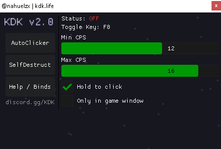

#🚀 KDK Clicker v2.0

  

  
  
  
  

---

## 📖 About

**KDK Clicker** was originally created as a boost rewards project within a faction environment.
It was never designed as a commercial autoclicker, as the market is already saturated with free tools offering the same core functionality.

Lightweight. Controlled. Functional.

---

## ⚙️ Features (v2.0)

### 🎛 Core Controls

* **Real-time Status Indicator** (ON / OFF)
* **Toggle Key:** `F8`
* **Custom Min CPS / Max CPS**
* Adjustable CPS range (example: `12 – 16`)

---

### 🖱 Click Behavior

* ✅ **Hold To Click**
  Activates only while holding the mouse button.

* ⬜ **Only In Game Window**
  Restricts clicks to the active game window.

---

### 🛠 Additional Sections

* **AutoClicker Panel** → Main configuration tab
* **SelfDestruct (Experimental)** → Attempts to clear basic execution traces
* **Help / Binds** → Keybind information
* **Discord Access** → `discord.gg/KDK`

---

## 📦 Usage

1. Launch the application
2. Set your desired CPS range
3.Press `F8` to toggle
4. Hold click (if enabled)

### 🔒 Hidden Mode

* The application **does not appear in the taskbar**.
* It runs in a **hidden state** by default.
* If the window does not appear, press **`F12`** to show it.

---

## 🧠 Technical Overview

* Improved randomization system
* Non-flat CPS distribution
* Thread-based behavior separation
* Minimal and lightweight UI

---

## ⚠ Disclaimer

This project was written some time ago.
The code may contain outdated structures or minor issues.

Use at your own discretion.

---

## 🤝 Contributing

You are free to fork, modify, and adapt this project for personal use.

---

## 🤖 Credits

README structured and optimized with the help of **ChatGPT**.